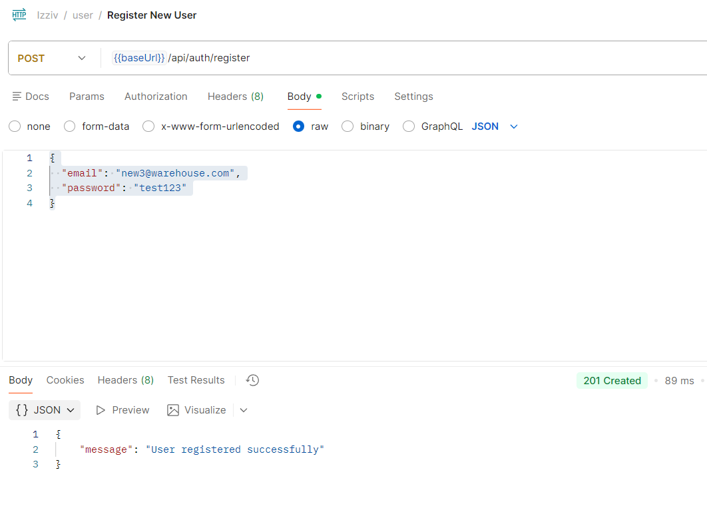
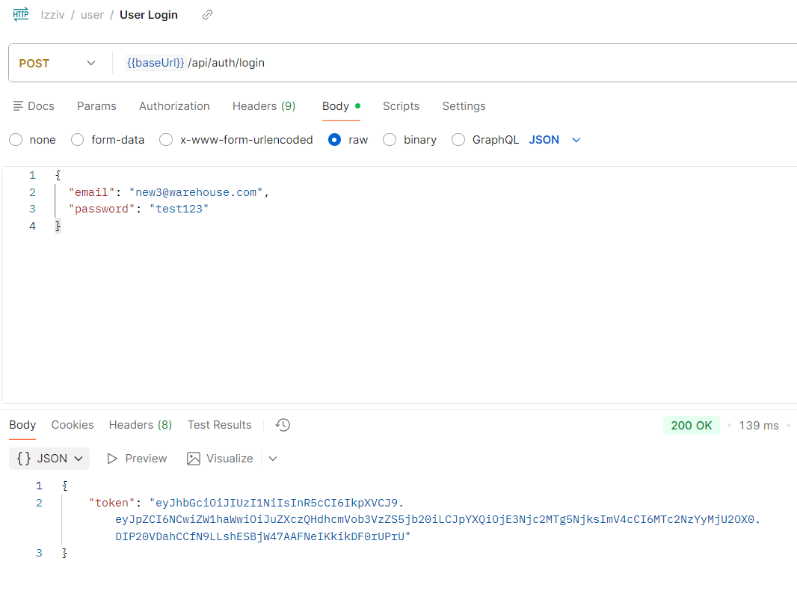

## Nastavitev baze podatkov

V mapi `backend/` se nahaja datoteka `.env`, ki vsebuje nastavitve za povezavo z MySQL bazo.

V vrstici:

```env
DB_PASSWORD=placeholder_password
```
zamenjajte placeholder_password z geslom MySQL uporabnika, ki ga uporabljate na svojem računalniku
(npr. geslo uporabnika root ali drugega MySQL uporabnika).

Če želite, lahko tudi spremenite uporabnika MySQL, tako da uredite vrstico:

```env
DB_USER=root
```

in zamenjate root z imenom drugega MySQL uporabnika, ki ga želite uporabiti.

#### Baza podatkov
V korenski direktorij projekta zaženite naslednji ukaz:

```bash
mysql -u root -p < warehouse_database.sql
```
Vnesite geslo MySQL uporabnika root.

Ta ukaz bo:
> ustvaril bazo podatkov

> ustvaril vse potrebne tabele

## Zagon backenda
V korenski direktorij projekta zaženite naslednji ukazi:
```bash
cd backend
npm install
npm start
```
Backend bo dostopen na: http://localhost:5000

## Zagon frontenda
V korenski direktorij projekta zaženite naslednji ukazi:
```bash
cd frontend
npm install
ng serve
```
Frontend bo dostopen na: http://localhost:4200

## Začetek uporabe
Pojdite na stran: http://localhost:4200

To nas pelje na **Home Page**.  
Spletno stran lahko uporabljate kot neprijavljeni uporabnik, lahko pa se tudi prijavite.  

#### Login
Prijava je možna s klikom na gumb **Login** v zgornjem desnem kotu.  
Obstoječi uporabniki so:  
- test@warehouse.com geslo: 12345  
- new@warehouse.com geslo: test123  
- newuser1@warehouse.com geslo: test123  
- new3@warehouse.com geslo: test123  

#### Registration
Možno je tudi registrirati novega uporabnika tako, da odprete **Login Page** in kliknete **Register here**.

### Testiranje registracije novega uporabnika preko Postmana
Spodnja slika prikazuje uspešno registracijo uporabnika `new3@warehouse.com` preko Postmana:



### Testiranje prijave preko Postmana

Spodnja slika prikazuje uspešno prijavo uporabnika `new3@warehouse.com` preko Postmana:

